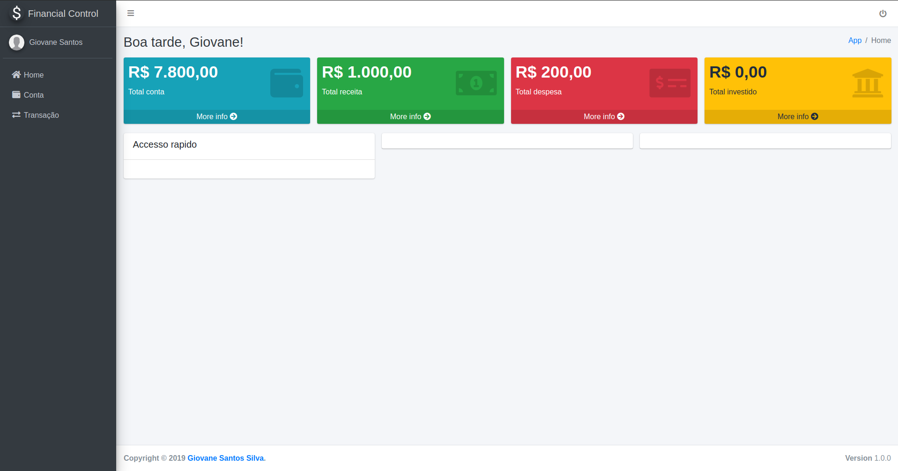
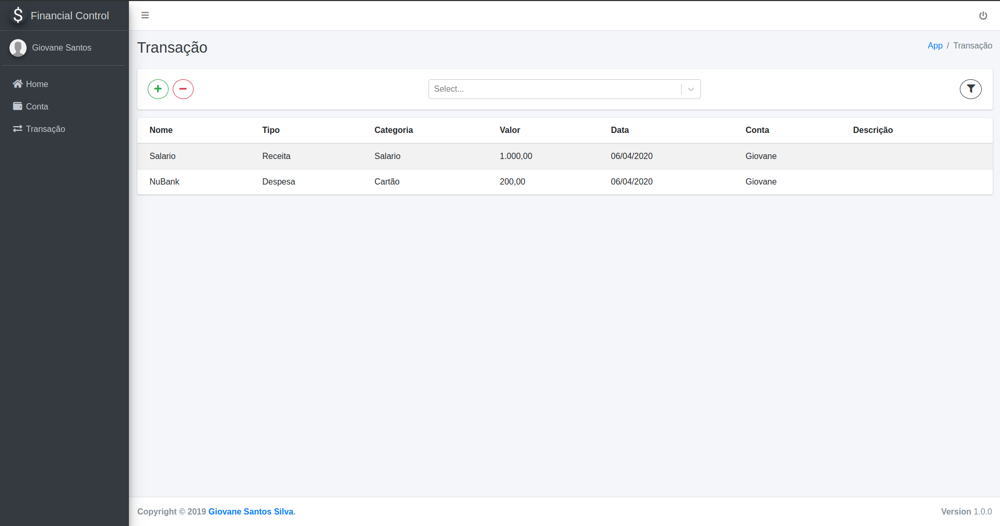

# React with Typescript
###### Author: [Giovane Santos](https://www.linkedin.com/in/giovane-santos-silva-a63790156/)

---
#### Description:
Complete application of financial control using React.js and Redux with typescript for Front-end and symfony mysql for Back-end

### How to use:
##### Install front-end
    cd frontend/
    yarn install
    yarn start

##### Install back-end
    cd backend/
    composer install
    
    configure .env DATABASE_URL
    
    php bin/console doctrine:database:create
    php bin/console doctrine:migrations:migrate
    
##### Configure database
    INSERT INTO `gc_financial`.`app_client` (`app_key`, `app_client`, `description`) VALUES ('gc_financial_web', 'ba8be10e0321ef4ec954edf66e9ddb2d', 'Application web')
    INSERT INTO `gc_financial`.`user` (`name`, `email`, `cpf`, `cell_phone`, `admin`, `date_created`) VALUES ('Giovane Santos', 'giovanesantos1999@gmail.com', '', '', 1, '2020-04-05 22:08:26')
    INSERT INTO `gc_financial`.`login` (`email`, `password`) VALUES ('giovanesantos1999@gmail.com', '$2y$10$Wkbog5wrYmOFvVRFF1gTM.YjAyZc6OGBjr15vVa4uIKpA5AhkjiwO')
    INSERT INTO `gc_financial`.`login_user` (`id_login`, `id_user`) VALUES (1, 1)
    INSERT INTO `gc_financial`.`transition_type` (`type`, `description`) VALUES ('Receita', 'Receita')
    INSERT INTO `gc_financial`.`transition_type` (`type`, `description`) VALUES ('Despesa', 'Despesa')
    INSERT INTO `gc_financial`.`transition_type` (`type`, `description`) VALUES ('Despesa', 'Despesa')
    INSERT INTO `gc_financial`.`transition_category` (`category`, `description`, `id_transition_type`) VALUES ('Salario', null, 1)
    INSERT INTO `gc_financial`.`transition_category` (`category`, `description`, `id_transition_type`) VALUES ('Cartão', null, 2)
    
##### Finally with
    php -S 0.0.0.0:8000 -t public/
    
    login:
        user: giovanesantos1999@gmail.com
        password: 123456
    
### Result:
   

   
    